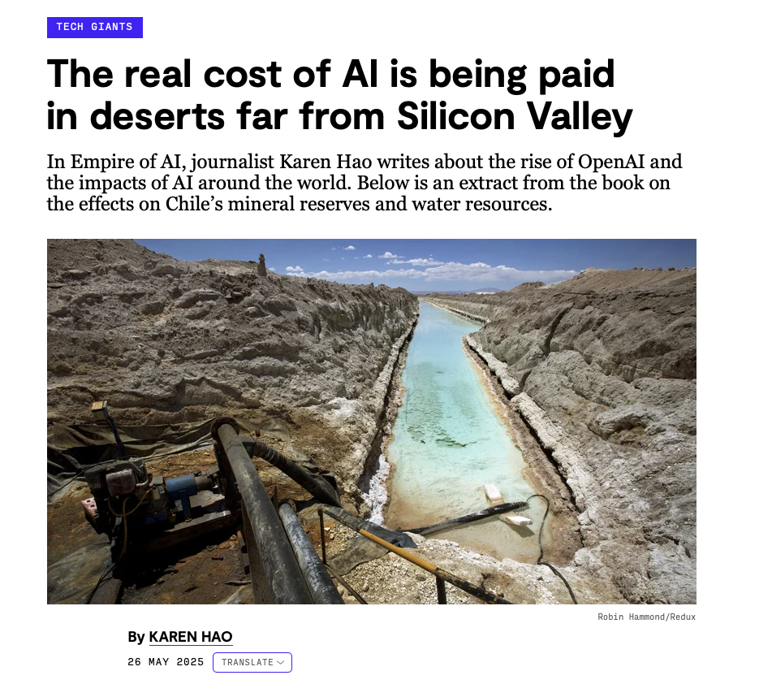
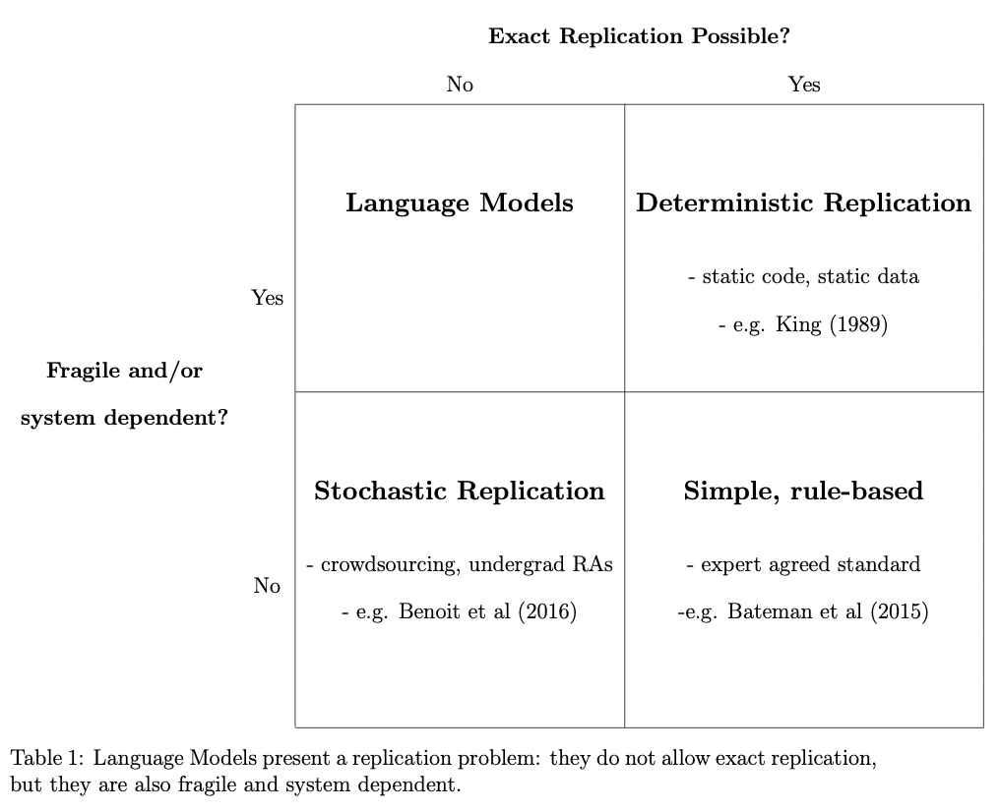
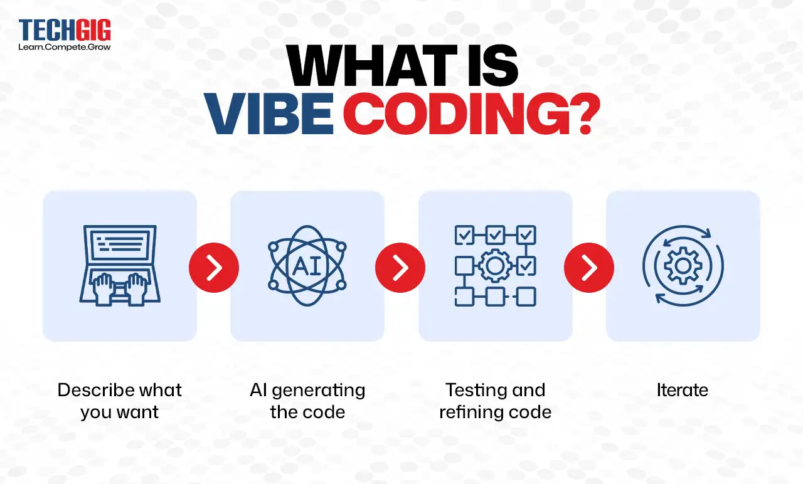
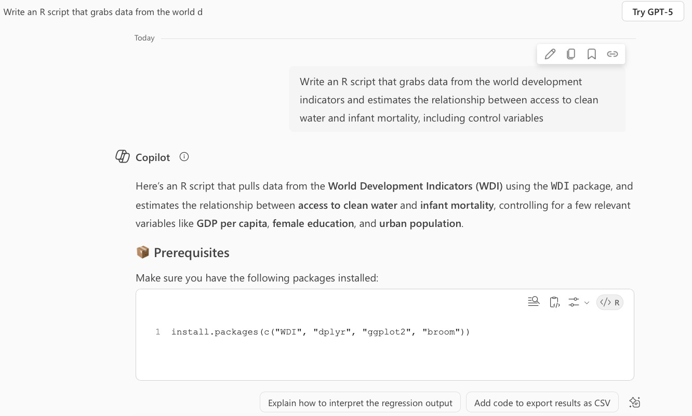
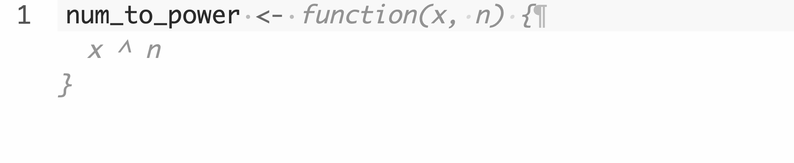

---
format:
  revealjs:
    slide-number: false
    progress: false
    code-overflow: wrap
---

::: {style="text-align: center"}
##  Coding with AI {.center .smaller}

&nbsp;    


**Gustavo Diaz**  
Department of Political Science  
Northwestern University  
<gustavo.diaz@northwestern.edu>  
[gustavodiaz.org](https://gustavodiaz.org)

&nbsp;

Materials: [gustavodiaz.org/statworkshop](https://gustavodiaz.org/statworkshop/)

{.absolute bottom=-100 right=-100 width="200" height="200"}

```{r include=FALSE}
library(knitr)

opts_chunk$set(fig.pos = "center", echo = FALSE, 
               message = FALSE, warning = FALSE)
```

```{r setup}
# Packages
library(tidyverse)
library(tinytable)
library(kableExtra)
```

:::

## About the workshop

```{r schedule, include = FALSE}
schedule =
  tribble(
    ~Date, ~Topic, ~Presenter,
    "September 30", "Dos and Don'ts of Coding with AI", "[Gustavo Diaz](https://gustavodiaz.org)",
    "October 21", "A Practical Guide to Ranking Data Analysis in the Social Sciences", "[Yuki Atsusaka](https://atsusaka.org)",
    "November 11", "Declaring and Diagnosing Research Designs", "[Alexander Coppock](https://alexandercoppock.com)"
    )
```


```{r show-schedule, echo = FALSE, results = "asis"}
schedule %>% 
  tt(width = 1) %>% 
  format_tt(j = 2:3, markdown = TRUE)
```

## Agenda

- Should you incorporate AI into your coding workflow?

- How not to?

- How to? (Github Copilot in RStudio)

- Demo

## My stance on using AI

- **Text:** No

- **Images/video:** No

- **Teaching:** Yes, I want students to learn how to use it responsibly

- **Coding:** Maybe? I don't see it much different from online searches

# Should you use it for coding?

## It feels like this

{fig-align="center"}

## It hides its ethical implications

{fig-align="center" width=55%}

::: aside
[restofworld.org/2025/ai-resource-extraction-chile-indigenous-communities/](https://restofworld.org/2025/ai-resource-extraction-chile-indigenous-communities/)
:::

## It is not *that* reliable

{fig-align="center" width=55%}

::: aside
Barrie, Palmer, Spirling. 2025. ["Replication for Language Models: Problems, Principles, and Best Practices for Political Science."](https://arthurspirling.org/documents/BarriePalmerSpirling_TrustMeBro.pdf)
:::


# How not to use it?

## Vibe coding

{fig-align="center"}

## Vibe coding example



## Vibe coding output

```{r, eval=FALSE, echo=TRUE}
# Load required libraries
library(WDI)
library(dplyr)
library(ggplot2)
library(broom)

# Define indicators
indicators <- c(
  "SH.H2O.SAFE.ZS",   # Access to clean water (% of population)
  "SP.DYN.IMRT.IN",   # Infant mortality rate (per 1,000 live births)
  "NY.GDP.PCAP.CD",   # GDP per capita (current US$)
  "SE.PRM.CMPT.ZS",   # Primary school completion rate (% of relevant age group)
  "SP.URB.TOTL.IN.ZS" # Urban population (% of total)
)

# Download data for the last available year
data_raw <- WDI(country = "all", indicator = indicators, extra = TRUE, latest = 1)

# Clean and filter data
data_clean <- data_raw %>%
  filter(region != "Aggregates") %>%  # Remove aggregate regions
  select(
    country, region,
    access_water = SH.H2O.SAFE.ZS,
    infant_mortality = SP.DYN.IMRT.IN,
    gdp_per_capita = NY.GDP.PCAP.CD,
    education = SE.PRM.CMPT.ZS,
    urban_pop = SP.URB.TOTL.IN.ZS
  ) %>%
  na.omit()

# Run linear regression
model <- lm(infant_mortality ~ access_water + gdp_per_capita + education + urban_pop, data = data_clean)

# Summarize results
summary(model)

# Tidy output
tidy(model)

# Optional: Plot relationship between access to water and infant mortality
ggplot(data_clean, aes(x = access_water, y = infant_mortality)) +
  geom_point(alpha = 0.6) +
  geom_smooth(method = "lm", se = TRUE, color = "blue") +
  labs(
    title = "Access to Clean Water vs Infant Mortality",
    x = "Access to Clean Water (% of population)",
    y = "Infant Mortality (per 1,000 live births)"
  ) +
  theme_minimal()
```

## What is the problem with this?

::: incremental
- Gives you code that works but you don't know *why* it works
- **Terrible** for learning
- Makes important decisions for you
- May use outdated/deprecated packages
- Mistakes may hurt you down the line
:::


---

{fig-align="center"}

# How to do it?

Use AI to **amplify** humans, not *replace* them

## Approaches

1. AI as a teaching assistant

2. AI as a collaborator

## AI as a TA

{fig-align="center"}

## AI as a TA

**Pros:**

- Improves *your* code
- Less intrusive than AI as collaborator

**Cons:**

- Lacks context
- Uneven learning
- Messes up your style

## AI as a collaborator

Get auto-complete suggestions from Copilot **within** RStudio

. . .

Ingredients:

- R and RStudio

- [GitHub Education account](https://github.com/education/)

- Internet connection

::: aside
You can do this even if you do not use GitHub for version control
:::

## GitHub Education Instructions

1. Create or associate account with Northwestern e-mail

2. Get your account verified [here]((https://github.com/education/)) (with proof of enrollment/employment)

3. [Set up in RStudio](https://docs.posit.co/ide/user/ide/guide/tools/copilot.html)  
`Tools > Global Options > Copilot`

4. Set code completion  
`Tools > Global Option > Code > Completion`

## Options

**Copilot Indexing:** Give access to project files?

**Copilot Completions:** Manual (`cmd + \` or `ctrl + \`) or Automatic (with delay)

## Uses

1. Auto-complete inline code



::: aside
Text in gray is the auto-complete suggestion
:::

## Uses

2. Questions

```{r, echo = TRUE, eval = FALSE}
# q: what function do I use to compare two means
t.test()
```

&nbsp;

. . .

```{r, echo = TRUE, eval = FALSE}
# q: what is the definition of standard error?
# a: The standard error (SE) is a statistical measure that quantifies 
# the variability or dispersion of a sample statistic, 
# such as the sample mean,
# from the true population parameter.
# It provides an estimate of how much the sample mean is expected to 
# fluctuate from the actual population mean
# due to random sampling variability.
```

::: aside
Answers adjusted for readability, it outputs a one-line comment by default
:::

## Uses

3. Provide context at the top

```{r, eval = FALSE, echo = TRUE}
# This script will load data from the World Development Indicators
# Then estimate the relationship between
# access to clean water and infant mortality
# using the lm_robust function from the estimatr package
# including gdp per capita as a control variable
```

. . .

```{r, echo = TRUE, eval = FALSE}
library(WDI)
```

. . .

```{r, echo = TRUE, eval = FALSE}
library(dplyr)
```

. . .

```{r, echo = TRUE, eval = FALSE}
library(estimatr)
```

::: aside
You then receive completion suggestions one step at a time
:::

## AI as collaborator

**Pros:**

- You need to know enough to give good instructions

- Doesn't break your flow

**Cons:**

- You need to know enough to give good instructions

- Always online

- It can be **very** intrusive (if you let it)

# Demo

## Resources for Python users

- [Copilot in VS Code](https://code.visualstudio.com/docs/copilot/overview)

- [ChatGPT in VS Code](https://marketplace.visualstudio.com/items?itemName=genieai.chatgpt-vscode)

- [Copilot code and Claude chat in Positron](https://positron.posit.co/assistant.html)